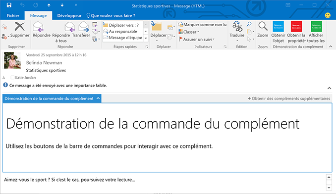

# Compléments Outlook

Les compléments Outlook sont des intégrations conçues par des tiers dans Outlook à l’aide de la nouvelle plateforme de technologies web. Les compléments Outlook comportent trois aspects clés :

- La logique métier et de complément est la même pour les versions Outlook de bureau pour Windows et Mac, sur le web (Office 365 et Outlook.com) et sur mobile.
    
-  Les compléments Outlook se composent d’un manifeste, qui décrit la manière dont le complément s’intègre dans Outlook (par exemple, un bouton ou un volet de tâches), ainsi que d’un code JavaScript/HTML, qui constitue l’interface utilisateur et la logique métier du complément.
    
- Les compléments Outlook peuvent être acquis à partir de l’Office Store ou chargés séparément par les utilisateurs finals ou les administrateurs.
    
Les compléments Outlook sont différents des compléments COM ou VSTO, qui sont de plus anciennes intégrations propres à Outlook s’exécutant sur Windows. Contrairement aux compléments COM, les compléments Outlook ne disposent d’aucun code installé physiquement sur l’appareil ou le client Outlook de l’utilisateur. Dans le cas d’un complément Outlook, Outlook lit le manifeste et raccorde des contrôles spécifiés dans l’interface utilisateur, puis charge le code JavaScript et HTML. Tout ceci s’exécute dans le contexte d’un navigateur dans un bac à sable (sandbox).

Les éléments Outlook qui prennent en charge les compléments de messagerie incluent notamment les messages électroniques, les demandes de réunion, les réponses à des demandes de réunion, les annulations de réunion et les rendez-vous. Chaque complément de messagerie définit le contexte dans lequel il est disponible, y compris les types d’éléments et si l’utilisateur lit ou compose un élément.

## Points d’extension

Les points d’extension correspondent à la manière dont les compléments sont intégrés à Outlook. Voici les méthodes possibles :

- Les compléments peuvent indiquer des boutons qui apparaissent dans les surfaces de commande dans les messages et les rendez-vous. Pour plus d’informations, voir [Commandes de complément pour Outlook](../outlook/add-in-commands-for-outlook.md).
    
    **Complément avec boutons de commande dans le ruban**

    

- Les compléments peuvent désactiver les correspondances d’expressions régulières ou des entités détectées dans les messages et les rendez-vous. Pour plus d’informations, voir [Compléments Outlook contextuels](../outlook/contextual-outlook-add-ins.md).
    
    **Complément contextuel pour une entité en surbrillance (adresse)**

    

- Les compléments peuvent apparaître dans le volet horizontal au-dessus du corps du message ou du rendez-vous. Cette méthode est basée sur des règles complexes, comme la présence de pièces jointes ou une classe d’élément Exchange du message ou du rendez-vous. Pour plus d’informations, voir [Compléments Outlook avec volet personnalisé](../outlook/custom-pane-outlook-add-ins.md).
    
    **Complément avec volet personnalisé en mode Lecture**

    

## Éléments de boîtes aux lettres disponibles pour les compléments

Les compléments Outlook sont disponibles pour les messages ou les rendez-vous en mode de lecture ou de composition, mais pas pour d’autres types d’élément. Outlook ne les active pas si l’élément de message actuel, en mode de composition ou de lecture, fait partie des éléments suivants :

- protégé par la Gestion des droits relatifs à l’information, au format S/MIME ou chiffré par d’autres moyens de protection. Un message signé de façon numérique constitue un exemple, puisque la signature numérique dépend de l’un de ces mécanismes ;
    
- situé dans le dossier Courrier indésirable ;
    
- un rapport ou une notification de remise qui a la classe de message IPM.Report.* (notamment les rapports de remise et les notifications d’échec de remise, ainsi que les notifications de lecture, de non-lecture et de retard) ;
    
- un fichier .msg joint à un autre message ;
    
- un fichier .msg ouvert à partir du système de fichiers.
    
En général, Outlook peut activer des compléments dans des formulaires de lecture pour des éléments du dossier Éléments envoyés, à l’exception des compléments qui s’activent en fonction des correspondances de chaîne d’entités connues. Pour plus d’informations sur les raisons de ce comportement, voir la section « Prise en charge des entités connues » dans la rubrique [Mettre en correspondance des chaînes dans un élément Outlook en tant qu’entités connues](../outlook/match-strings-in-an-item-as-well-known-entities.md).

## Hôtes pris en charge

Les compléments Outlook sont pris en charge dans Outlook 2013 et versions ultérieures, Outlook 2016 pour Mac, Outlook Web App pour Exchange 2013 en local, Outlook Web App dans Office 365 et Outlook.com. Toutes les nouvelles fonctionnalités ne sont pas prises en charge dans tous les clients en même temps. Reportez-vous aux rubriques spécifiques et aux références d’API, pour identifier les hôtes qui sont pris en charge ou non.

## Commencer à créer des compléments Outlook

Pour commencer à créer des compléments Outlook, voir [Get Started with Outlook add-ins for Office 365](https://dev.outlook.com/MailAppsGettingStarted/GetStarted).

## Ressources supplémentaires

- [Vue d’ensemble de l’architecture et des fonctionnalités des compléments Outlook](../outlook/overview.md)
- [Meilleures pratiques en matière de développement de compléments Office](../../docs/overview/add-in-development-best-practices.md)
- [Instructions de conception pour les compléments Office](../../docs/design/add-in-design.md)
- [Gérer les licences de compléments pour Office et SharePoint](http://msdn.microsoft.com/library/3e0e8ff6-66d6-44ff-b0c2-59108ebd9181%28Office.15%29.aspx)
- [Publier votre complément Office](../publish/publish.md)
- [Soumission des compléments SharePoint et Office, ainsi que des applications web Office 365 dans l’Office Store](http://msdn.microsoft.com/library/ff075782-1303-4517-91cc-b3d730e9b9ae%28Office.15%29.aspx)

